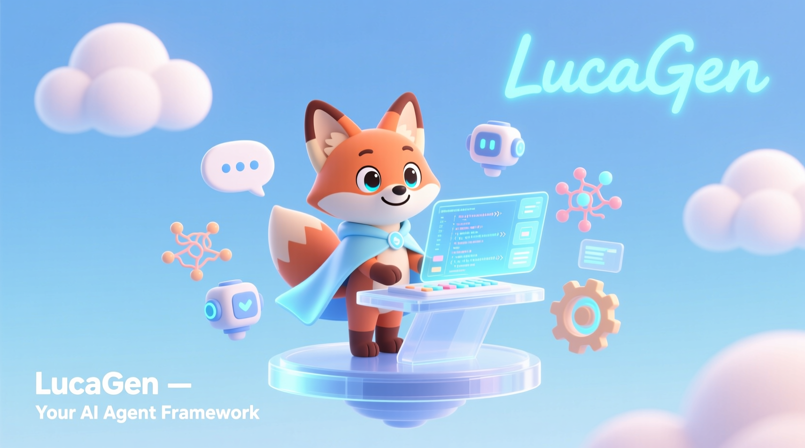

### 🌀 LucaGen：*A simple agent workflow building framework that supports various LLM and memory technologies (based on [Hello-Agents](https://github.com/datawhalechina/Hello-Agents)).*

 
     <a href="./README_CN.md">简体中文</a> |      <a href="./README.md">English</a>   

  
      

  

 

**This project is primarily designed for learning and extension purposes. The majority of the code and architectural design is derived from Hello-Agents. We have expanded upon the original foundation, integrating new features and modifying specific components.**

------

#### 🚧 Coming Soon

> **LucaGen is currently under active development.**
>  A lightweight, highly flexible agent workflow framework is on the way. Stay tuned!

------

#### 📖 Introduction

*This section is under construction… More details coming soon.*

------

#### ✨ Key Features

------

#### 🧩 Architecture

*Architecture diagrams & explanations coming soon…*

------

#### 🚀 Getting Started

##### 

------

#### 🗺️ Roadmap

------

#### 🤝 Contributing

 Feel free to open issues or submit pull requests.